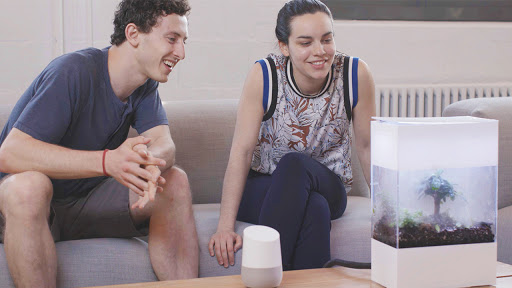

# Project Oasis

Project Oasis is a voice controlled terrarium that recreates outside weather inside a box. You can talk to it to ask about weather or ask it to create certain conditions. It currently recreates rain, clouds and lighting in a self sufficient closed and living ecosystem.

## Overview
This project comprises of three modules: 1) Dialogflow functions, 2) Cloud PubSub NodeJS listener, and 3) Arduino sketch

We use Google's Dialogflow to parse natural language for the required parameters of city, location or action. User's voice input are mapped to actions or functions exported in the Dialogflow fulfillment.

These functions use openweathermap api to extract information about clouds, rain, light conditions at a particular location. The result JSON is passed onto the terrarium using Google's Cloud PubSub - a realtime notification system. PubSub messages then trigger appropriate components within the terrarium. 

## Hardware
We run the Cloud PubSub nodejs client in a Raspberry Pi 3. An arduino is connected over USB with RPi. On receiving PubSub messages, the nodejs client sends serial codes to an arduino.

The Arduino has been programmed through a sketch to receive these serial codes and trigger corresponding relays on/off.

Raspberry Pi 3  ->  Arduino (USB Serial)
				             |
			 ________________|________________
			|                |                |
           Mist            Rain             Lights
      [5V Ceramic    [5-12V Peristaltic     [5V LED lights]
      Resonators]          Pump]

## Before you start

** DialogFlow / Actions on Google **
Follow the steps [here](https://developers.google.com/actions/dialogflow/first-app) to create a Dialogflow agent. 
We use a welcome intent that allows the user to start talking to the terrarium.
There are additional intents for the user to enquire about the weather at certain location, time (e.g: 'show me the weather in seattle') or invoke an explicit action (e.g: 'make it rain')

You will need to deploy your cloud functions which are mapped to user's actions. 
-> Follow the instructions [here] (https://dialogflow.com/docs/how-tos/getting-started-fulfillment) to enable the cloud functions for firebase. 
-> Steps to deploy the functions from  CLI are under *Deploy Your Functions with the Firebase CLI* on the same link

Specific instructions for terrariumDialogflow agent are here.

** Cloud PubSub **
Setup a Cloud PubSub project as in [this link](https://cloud.google.com/pubsub/docs/quickstart-console)

Follow the steps to create a topic. We created a Topic named 'Weather' in our project, to which we added our subscriptions.
We only use pull subscriptions in this project. The subscription was terrarium was named as *weather-detail*

Note the *project id* for this project as it'll come in handy to run the listener client later.

** Openweather API **
Get your [API key](https://openweathermap.org/appid#get) from openweathermap.org
Add this key in the cloud functions so that those functions can ping the weather servers when the user asks for specific info.

** Install NodeJS ** 
Install NodeJS on your RPi

## How to run these modules

** Dialogflow Cloud function deployment **
Navigate to the directory of your functions and the run the following in order
*npm install*
*firebase login*
*firebase init*

And finally run
*firebase deploy to deploy your functions*

The deployed functions' link becomes the webhook URL for Dialogflow.

** Cloud PubSub **
Naivgate to the directory of the *subscription.js* & *package.json* file and run *npm install* to install the dependencies.
When you're ready, run *node subscritpions.js listen-messages weather-detail* where *weather-detail* is the subscription you created from a previous step.

** Google Home / AIY Voice Kit test deployment **
Your can either use a Google Home or an AIY Voice Kit to interact with the terrarium. We included an AIY Voice Kit on top of Raspberry Pi 3 so as to interact with the terrarium directly as well.

Follow the instructions [here](https://developers.google.com/actions/smarthome/testing-deploying) to test and deploy your app on Google Home. You can then use a Google Home associated with your associated account by talking to it to trigger the terrarium and asking it about the weather

## Build your own terrarium
You can also build your own terrarium. Detailed instructions of fabrication and electronics are here.

## Contributors
Made by Harpreet Sareen and friends at the Google Creative Lab.

This project follows [Google's Open Source Community Guidelines](https://opensource.google.com/conduct/).

Note: This is not an officially supported Google product
